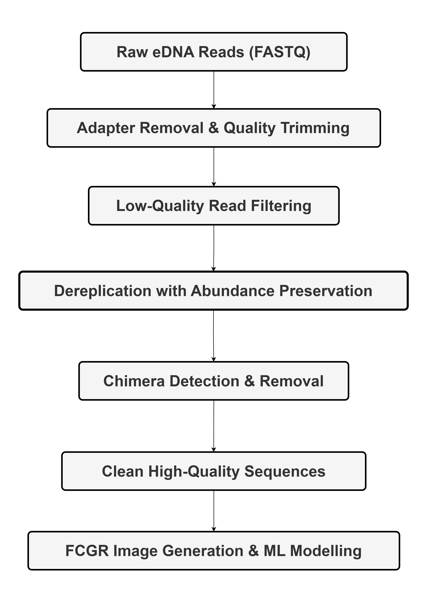
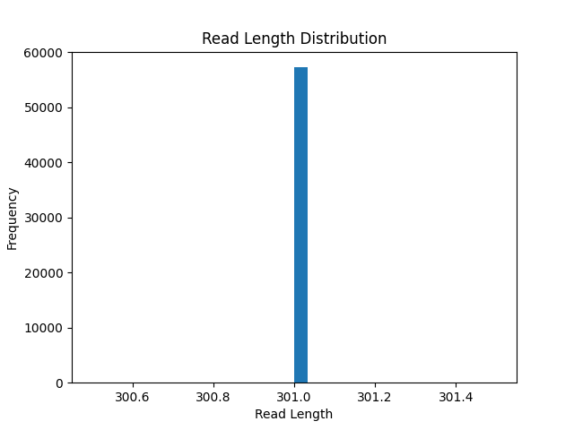
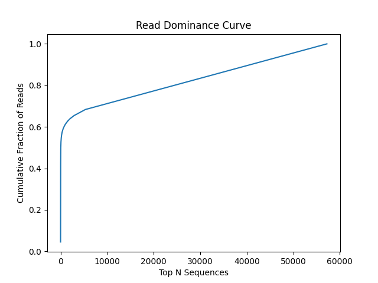

# Identifying Novel Taxonomy from eDNA Datasets using Multi-scale FCGR and Invariant Information Clustering

> A fully unsupervised, alignment-free framework for discovering putative novel taxa from deep-sea environmental DNA (eDNA) datasets using multi-scale sequence representations and self-supervised clustering.

---

## Overview

Deep-sea ecosystems contain vast amounts of unexplored biodiversity, yet a substantial fraction of environmental DNA (eDNA) sequences remain unclassified due to fragmented reads, sparse reference databases, and extreme abundance imbalance.

This repository contains the complete implementation accompanying our research paper:

**Identifying Novel Taxonomy from eDNA Datasets using Multi-scale FCGR and Invariant Information Clustering**

The proposed framework combines:

* Biology-informed eDNA preprocessing
* Multi-scale Frequency Chaos Game Representation (FCGR)
* Abundance-aware mimic sequence generation
* Self-supervised Invariant Information Clustering (IIC)
* Attention-based multi-branch neural architectures
* Ensemble clustering and novelty assessment

Unlike conventional taxonomic assignment pipelines, this approach does not rely on sequence alignment or reference databases, making it particularly suitable for biodiversity exploration in poorly characterized environments.

---

## Key Contributions

<h3>Biology-Aware Preprocessing</h3>

<p>
A structured preprocessing workflow designed to remove sequencing artefacts while preserving rare biological signals.
</p>

<a href="assets/Preprocessing_Diagram_final.png">
  
</a>

---

### Multi-scale FCGR Encoding

DNA sequences are transformed into Frequency Chaos Game Representations at multiple resolutions:

| k | FCGR Resolution | Captures                          |
| - | --------------- | --------------------------------- |
| 4 | 16 × 16         | Short-range motifs                |
| 5 | 32 × 32         | Intermediate composition patterns |
| 6 | 64 × 64         | Higher-order sequence signatures  |

<a href="assets/FCGR & Mimic Generation.png">
  
</a>

Multi-scale fusion enables simultaneous modeling of local and global compositional characteristics.

---

### Self-Supervised Deep Clustering

A multi-branch convolutional neural network processes FCGR representations independently and combines them using attention-based feature fusion.

<a href="assets/Clustering architecture.png">
  
</a>

Training is performed using:

* Invariant Information Clustering (IIC)
* Mutual Information Maximization
* Relaxed Entropy Regularization
* Abundance-Weighted Batch Learning

This enables discovery of latent biological structure without taxonomic labels.

---

### Ensemble-Based Novelty Discovery

Three independently trained models are aligned using the Hungarian Algorithm and aggregated through consensus voting.

Novel taxa are identified using:

* Low ensemble confidence
* High predictive entropy
* Small cluster structure
* Ensemble disagreement

---

## Dataset

**Source:** Mariana Trench Deep-Sea Sediment eDNA Dataset

* BioProject: PRJNA658834
* Accession: SRX9086406
* Sequencing Platform: Illumina MiSeq
* Marker Gene: 18S rRNA

The dataset represents a challenging biodiversity discovery scenario due to:

* Fragmented reads
* Long-tail abundance distributions
* Sparse taxonomic references
* High proportions of unknown sequences

---

## Experimental Results

### Preprocessing Outcome

| Metric              | Value     |
| ------------------- | --------- |
| Clean Sequences     | 57,221    |
| Read Length         | 301 bp    |
| Active Clusters     | 263 / 300 |
| Cluster Utilization | 87.7%     |

<table align="center">
<tr>
<td align="center" width="30%">
<br>
<em>(a) Read Length Distribution</em>
</td>

<td align="center" width="30%">
<br>
<em>(b) GC Content Distribution</em>
</td>
</tr>

<tr>
<td align="center" width="30%">
<br>
<em>(c) Sequence Abundance Distribution</em>
</td>

<td align="center" width="30%">
<br>
<em>(d) Read Dominance Curve</em>
</td>
</tr>
</table>

---

### Novel Taxa Discovery

| Metric                | Value  |
| --------------------- | ------ |
| Putative Novel Taxa   | 14,570 |
| Percentage of Dataset | 25.5%  |
| Ensemble Disagreement | 17.5%  |
| Ensemble Variation    | 3.2%   |

---

### Biological Validation

To evaluate biological plausibility, 200 representative candidate sequences were queried against the NCBI 18S rRNA BLAST database.

**Results**

* 143 / 200 sequences (71.5%) exhibited strong evidence of species-level novelty.
* 99 sequences returned no database match.
* Multiple candidates showed divergence beyond species-level thresholds.

<a href="assets/Donut Chart.png">
  
</a>

These findings support the ability of the framework to identify previously uncharacterized biodiversity.

---

## Future Directions

* Phylogenetic characterization of novel candidates
* Multi-marker eDNA integration
* Multi-omics biodiversity discovery
* Adaptive cluster sizing
* Uncertainty-aware clustering objectives

---

## Citation

If you use this work, please cite:

```bibtex
@inproceedings{yourcitation,
  title={Identifying Novel Taxonomy from eDNA Datasets using Multi-scale FCGR and Invariant Information Clustering},
  author={Tiwari, Sanskriti and Lavanya, R. and Jayakumar, Iraa},
  year={2026}
}
```

---

## Authors

* Sanskriti Tiwari
* Dr. R. Lavanya
* Iraa Jayakumar

Department of Computing Technologies
SRM Institute of Science and Technology

---

## License

This project is released under the MIT License.
